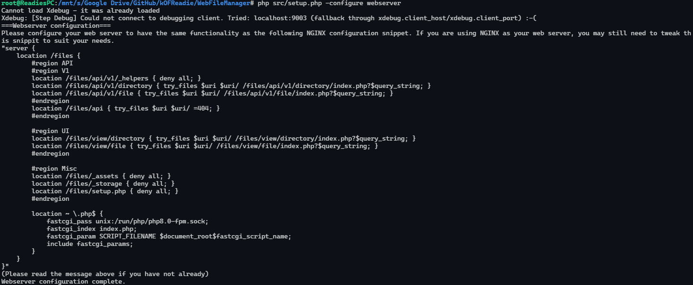

# WebFileManager
## Bookmarks
- [Features](#features)
- [Installation](#installation)
- [Getting started](#getting-started)
- [Plans for future updates](#plans-for-future-updates)
- [Devloper guide](#devloper-guide)
- [Contact](#contact)

## Features
- File browser
- File sharing
- Misc features
    - File sharing with an expiry date
    - Formatted embeds
    - Customisable accent colour
    - Customisable page name

## Web interface
### File browser


### File sharing


### Shared folder


### Admin panel


### File preview


### Client account page


## Installation
### Requirements
- PHP 8.0+
- Composer
- MySQL/MariaDB
- FFMPEG

To install this program, download the latest version from this [repository](https://github.com/kOFReadie/WebFileManager/releases/latest).  
Place the files in the desired location, preferably in a directory accessable by the web server.  
Now run the following command in the directory containing the files to initialise the setup.
```sh
php setup.php
```
You will be asked a few questions during the setup process like so:  


**Note:** The setup will output some text to the console that will requre you to copy and configure for your own web server.

If you wish to change any of the settings you can run the same command to do so. If you want to setup a specific part again then you can run the command with `-configure <part>` like so:
```sh
php setup.php -configure webserver
```


## Getting started
### Getting onto the app
Once you have installed and set up the program, you should be able to access the page from your webserver.  
The first thing you should do is log into the default admin account with the username `admin` and the password `AdminUser01`.  
**Note:** The default admin account is only used for the initial setup and is not intended to be used for normal use, it is highly advised that you change the password for the default admin account.

### Managing accounts
You can create and manage accounts from the admin page, this page is only accessible by admin users.  
Usernames must be between 4 and 20 characters long and contain only letters, numbers and underscores, once an account is created the username cannot be changed.  
Passwords must be between 8 and 32 characters long and contain at least one uppercase and lowercase letter and at least one number character.  
Administrative privileges can be given to accounts when creating or updating them.

### Managing paths
Paths are the "root" folders that the website will use to read files from the system.  
To add and manage paths, go to the admin page and click the `Paths` tab.  
The `web path` is the path that will be accessed from the website and must only contain letters.  
The `local path` is the path that will be accessed from the server, this path must be a valid directory on the server.

### Browsing files
You can browse files from the website by clicking on the `Files` tab.
**Note:** Only registered users can access the file browser unless the url is to a public file or folder.

### Sharing files
Files can be shared to the public with or without an expiry date.  
To share a file, navigate to the `Files` tab and click the share button on the file or folder you wish to share.  
**Note:** The root folders cannot be shared.  
When sharing a file or folder, you can specify choose to add an expiry date to the share.  
To access the shared file or folder, copy the link from the sharing menu and paste it into the address bar of your browser, the page has been designed so that the parent folders of the shared file or folder will not be exposed to the public.

## Plans for future updates
- Add support for creating, editing and deleting files
- Add support for creating, editing and deleting folders
- Add support for uploading files and folders

## Devloper guide
### API V1
This version of the api is rather basic but is functional.  
All requests return JSON data unless it is for a file.  
If an error occurs, the response will contain a JSON message with the error.
```json
{
    "error": "<ERROR_MESSSSAGE>"
}
```
Below are all the possible error messages:
```
INVALID_PATH
NO_RESPONSE
METHOD_NOT_ALLOWED
DIRECT_REQUEST_NOT_ALLOWED
INVALID_PARAMETERS
INVALID_ACCOUNT_DATA
ACCOUNT_ALREADY_EXISTS
ACCOUNT_NOT_FOUND
PATH_ALREADY_EXISTS
DATABASE_ERROR
THUMBNAL_ERROR
INVALID_FILE_TYPE
SHARE_EXPIRED
UNKNOWN_ERROR
```
API V1 supports the following requests:  
**Documentation is in progress**

## Contact
If you have any questions, please contact me on Discord (Readie#6594) or GitHub.